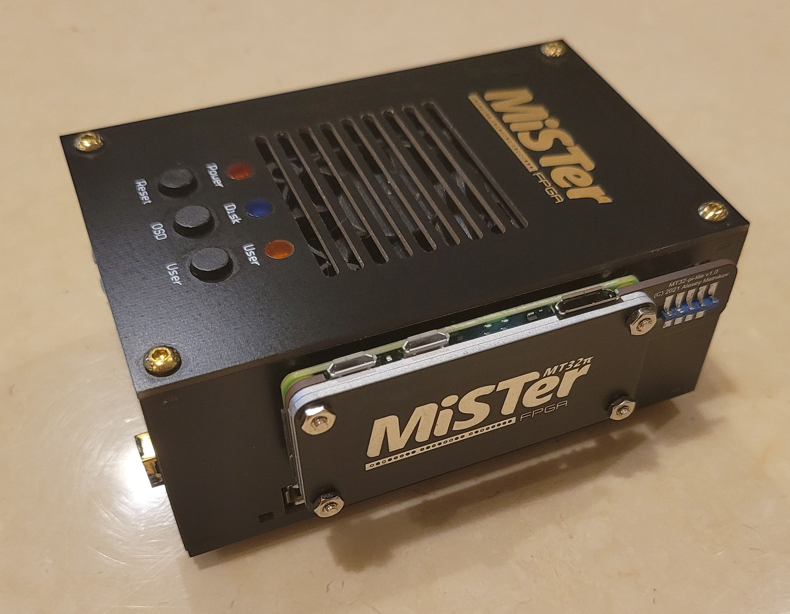
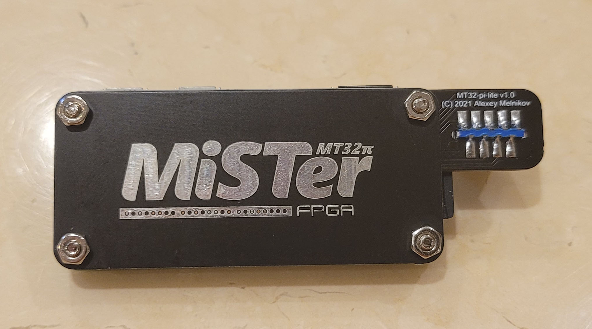
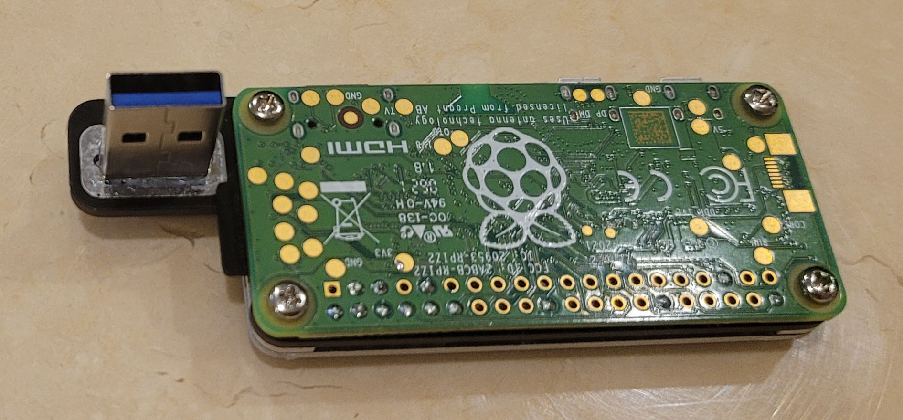
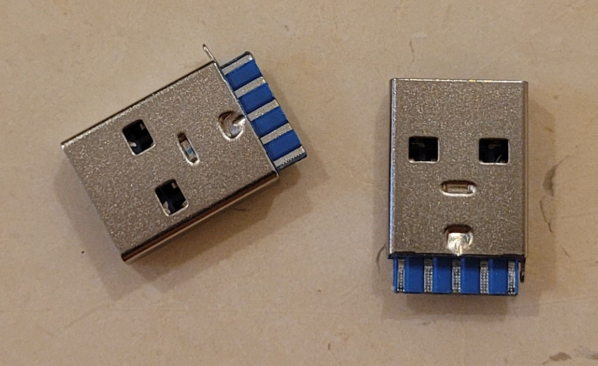

# MT32-pi Lite boards set

* MT32Pi_lite - simplified MT32-pi board for Raspberry PI Zero 2
* MT32Pi_lite_Top - single sided aluminum 1.6mm PCB used as heat sink. This board needs spacers about ~1.5mm for screws. It needs thermal tape of 3mm thickness for main chip.
* MT32Pi_lite_Top_Cut - same as above but with cut places to mount it on top without spacers. It needs 2mm thick thermal tape.

As an option: you may mount both MT32Pi_lite_Top_Cut and MT32Pi_lite_Top, so Cut version will be used as a spacer and additional heat dissipation.

MT32Pi_lite board is soldered directly to RPI with short pins without connector. No need to solder all 34 pins. Soldering outlined pins is enough.

Whole pancake is plugged directly into USER I/O port as a side cart.

It needs a special USB3.0 connector:

It can be found on Aliexpress and Amazon.

